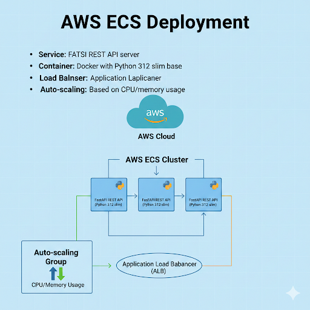

# Vehicle Type Classification with Deep Learning

## Project Introduction

This project implements an end-to-end vehicle type classification system using deep learning. The system can automatically identify and classify vehicles into five categories: **hatchback**, **motorcycle**, **pickup**, **sedan**, and **suv** from images.

### Key Features
- **High Accuracy**: Achieves 89.9% validation accuracy using MobileNetV2 architecture
- **Production Ready**: Containerized FastAPI service deployed on AWS ECS
- **Efficient Inference**: ONNX model format for optimized performance (<100ms per image)
- **Real-world Application**: Handles class imbalance and various image conditions

### Use Cases
- **Traffic Management**: Automated vehicle counting and classification
- **Parking Systems**: Smart parking allocation based on vehicle type
- **Insurance**: Automated vehicle type verification for claims
- **Fleet Management**: Vehicle inventory and monitoring systems
- **Security**: Access control based on vehicle classification

## Project Structure

```
Vehicle-Type-Detection-Deep-Learning/
├── model_file/
│   ├── vehicle_identifier_mobilenet_v2.onnx     # ONNX model for inference
│   ├── vehicle_identifier_mobilenet_v2.onnx.data # External model data
│   └── vehicleclassifier_WDA_32_0.899.pth       # PyTorch checkpoint
├── scripts/
│   ├── train.py          # Training pipeline
│   ├── predict.py        # FastAPI prediction server
│   ├── test_local.py     # Local testing script
│   └── test_cloud.py     # Cloud deployment testing
├── test_images/          # Sample images for testing
├── Dockerfile           # Container configuration
├── requirements.txt     # Python dependencies
└── Pipfile             # Pipenv configuration
```

## Dataset Details

### Data Source & Citation
The dataset is sourced from Mendeley Data:

**Citation**: Boonsirisumpun, Narong; Surinta, Olarik (2021), "Vehicle Type Image Dataset (Version 1): VTID1", Mendeley Data, V1, doi: 10.17632/r7bthvstxw.1

- **Dataset URL**: https://data.mendeley.com/datasets/r7bthvstxw/1
- **Download URL**: https://prod-dcd-datasets-cache-zipfiles.s3.eu-west-1.amazonaws.com/r7bthvstxw-2.zip
- **Total Images**: 1,310 vehicle images
- **Format**: RGB images in various resolutions
- **Classes**: 5 vehicle types (hatchback, motorcycle, pickup, sedan, suv)
- **Data Acquisition**: Automatically downloaded and processed by training script

### Class Distribution & Imbalance Handling
The dataset exhibits significant class imbalance, addressed using weighted cross-entropy loss:

| Vehicle Class | Samples | Percentage | Weight Applied |
|---------------|---------|------------|----------------|
| Pickup        | 478     | 36.5%      | 0.55           |
| Sedan         | 400     | 30.5%      | 0.65           |
| Hatchback     | 181     | 13.8%      | 1.44           |
| SUV           | 129     | 9.8%       | 2.02           |
| Motorcycle    | 122     | 9.3%       | 2.14           |

## Model Architecture & Training

### Architecture
MobileNetV2-based transfer learning approach:

```
MobileNetV2 (ImageNet pretrained, frozen)
    ↓
Global Average Pooling (1x1)
    ↓
Dropout (p=0.2)
    ↓
Linear Classifier (1280 → 5 classes)
```

### Training Configuration
- **Loss Function**: Weighted CrossEntropyLoss (addresses class imbalance)
- **Optimizer**: Adam (lr=0.01)
- **Batch Size**: 32
- **Input Size**: 224×224 RGB images
- **Data Split**: 80% train, 10% validation, 10% test

### Data Augmentation
- Random Horizontal Flip (50% probability)
- Random Rotation (±15 degrees)
- Color Jitter (brightness, contrast, saturation ±20%)
- Random Resized Crop (scale 0.8-1.0)
- ImageNet normalization

### Performance Results
- **Validation Accuracy**: 89.9%
- **Model Size**: 14MB (ONNX format)
- **Inference Speed**: <100ms per image on CPU

## Deployment Architecture

### AWS ECS Deployment
- **Service**: FastAPI REST API server
- **Container**: Docker with Python 3.12 slim base
- **Load Balancer**: Application Load Balancer
- **Endpoint**: `http://vehicle-type-identifier-880645094.ap-south-1.elb.amazonaws.com`
- **Auto-scaling**: Based on CPU/memory usage

           
  
### API Endpoints
- **POST /predict**: Upload image for vehicle classification
- **GET /health**: Service health check

## Quick Start

### Prerequisites
- Python 3.10+ or Docker
- Pre-trained model files included in repository

### Local Setup
```bash
git clone <repository-url>
cd Vehicle-Type-Detection-Deep-Learning

# Install dependencies
pipenv install && pipenv shell
# OR
pip install -r requirements.txt

# Run prediction server
python scripts/predict.py
# Server runs on http://localhost:8000

# Test with sample images
python scripts/test_local.py
```

### Docker Deployment
```bash
docker build -t vehicle-classifier .
docker run -p 8000:8000 vehicle-classifier
```

### Cloud Testing
```bash
# Test live AWS ECS service
python scripts/test_cloud.py "https://example.com/car-image.jpg"
```
Example urls:
suv 

python scripts/test_cloud.py "https://images.unsplash.com/photo-1533473359331-0135ef1b58bf?q=80&w=1170&auto=format&fit=crop&ixlib=rb-4.1.0&ixid=M3wxMjA3fDB8MHxwaG90by1wYWdlfHx8fGVufDB8fHx8fA%3D%3D"

sedan:


python scripts/test_cloud.py "https://images.unsplash.com/photo-1591363748916-d7f3f2df01b0?q=80&w=749&auto=format&fit=crop&ixlib=rb-4.1.0&ixid=M3wxMjA3fDB8MHxwaG90by1wYWdlfHx8fGVufDB8fHx8fA%3D%3D"


hatchback

python scripts/test_cloud.py "https://www.shutterstock.com/shutterstock/photos/1143627347/display_1500/stock-photo-chiangmai-thailand-july-new-private-sedan-car-toyota-yaris-ativ-eco-car-photo-at-1143627347.jpg"


pickup:

python scripts/test_cloud.py "https://www.shutterstock.com/shutterstock/photos/2445345389/display_1500/stock-photo-chiangmai-thailand-september-private-pickup-truck-car-toyota-hilux-revo-on-road-no-2445345389.jpg"


motorcycle:

python scripts/test_cloud.py "https://www.shutterstock.com/shutterstock/photos/2389371229/display_1500/stock-photo-editorial-use-only-a-motorcycle-taxi-driver-wearing-an-orange-waist-coat-and-crash-helmet-taken-2389371229.jpg"

## API Usage

### cURL Example
```bash
curl -X POST "http://localhost:8000/predict" \
     -H "Content-Type: multipart/form-data" \
     -F "file=@test_images/car.jpg"
```

### Python Example
```python
import requests

with open("car_image.jpg", "rb") as f:
    response = requests.post("http://localhost:8000/predict", files={"file": f})
    result = response.json()
    print(f"Vehicle: {result['label']}, Confidence: {result['confidence']:.2f}")
```

### Response Format
```json
{
  "label": "sedan",
  "confidence": 0.8945,
  "probabilities": [0.0123, 0.0234, 0.0345, 0.8945, 0.0353]
}
```

## Performance Metrics

- **Accuracy**: 89.9% validation accuracy
- **Inference Speed**: <100ms per image
- **Model Size**: 14MB (ONNX)
- **Memory Usage**: <512MB during inference
- **Supported Formats**: JPG, PNG, WebP
- **Input Resolution**: 224×224 (auto-resized)

## Future Implementations

### Model Improvements
- **Multi-scale Training**: Implement training with multiple image scales for better generalization
- **Advanced Architectures**: Experiment with EfficientNet, Vision Transformers (ViT)
- **Model Ensemble**: Combine multiple models for improved accuracy
- **Quantization**: INT8 quantization for faster mobile inference

### Feature Enhancements
- **Real-time Video Processing**: Extend to video streams and real-time classification
- **Multi-vehicle Detection**: Integrate with object detection (YOLO) for multiple vehicles per image
- **Additional Classes**: Expand to more vehicle types (bus, truck, van, etc.)
- **Confidence Thresholding**: Implement rejection for low-confidence predictions

### Deployment & Infrastructure
- **Edge Deployment**: TensorRT optimization for NVIDIA Jetson devices
- **Mobile Apps**: React Native/Flutter apps with on-device inference
- **Kubernetes**: Migrate from ECS to EKS for better scalability
- **Monitoring**: Implement MLOps pipeline with model drift detection
- **A/B Testing**: Framework for testing different model versions

### Data & Training
- **Active Learning**: Implement active learning for continuous model improvement
- **Synthetic Data**: Generate synthetic vehicle images for data augmentation
- **Federated Learning**: Distributed training across multiple data sources
- **AutoML**: Automated hyperparameter tuning and architecture search

## Troubleshooting

**Common Issues**:
- **Port 8000 in use**: Change port in `scripts/predict.py`
- **Model file not found**: Ensure model files are in `model_file/` directory
- **Import errors**: Install dependencies with `pip install -r requirements.txt`
- **Memory issues**: Reduce batch size or use CPU inference

## Citation

If you use this project or dataset in your research, please cite:

```bibtex
@data{boonsirisumpun2021vehicle,
  author = {Boonsirisumpun, Narong and Surinta, Olarik},
  title = {Vehicle Type Image Dataset (Version 1): VTID1},
  year = {2021},
  publisher = {Mendeley Data},
  version = {V1},
  doi = {10.17632/r7bthvstxw.1},
  url = {https://data.mendeley.com/datasets/r7bthvstxw/1}
}
```
